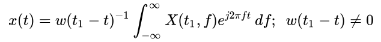
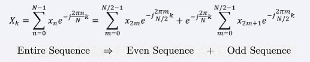

# Istft

<!-- md-trans-meta sourceCommit=cec88e057607a630073cce4bbace3c21f8d93fe7 translatedAt=2026-08-12T10:55:59.805Z pushedAt=2026-08-20T11:47:59.783Z -->

## Applicable Product

|Product|Supported|
|:-------------------------|:----------:|
|<term>Atlas 200I/500 A2 inference products</term>|×|
|<term>Atlas inference products</term>|×|
|<term>Atlas training products</term>|×|
|<term>Atlas A3 training products/Atlas A3 inference products</term>|√|
|<term>Atlas A2 training products/Atlas A2 inference products</term>|√|
|<term>Ascend 950PR/Ascend 950DT</term>|×|

## Function Description

- API function:

`asdFftIstftMakePlan`: Initializes the istft configuration corresponding to this handle.\
`asdFftExecIstft`: Performs the inverse short-time Fourier transform (ISTFT).

- Formula:

The istft function is used to perform the inverse short-time Fourier transform (ISTFT). Its goal is to convert the frequency-domain data obtained from STFT back into a time-domain signal, serving as the inverse operation of STFT. The short-time Fourier transform is reversible, meaning that the original signal can be restored from the STFT-transformed signal via the ISTFT. The most widely accepted ISTFT method is the overlap-add method.

  

  The Fourier transform is a linear integral transform used for converting signals between the time domain and frequency domain, and has many applications in physics and engineering. For a signal of length N, the DFT expression is as follows:

  

  By treating the coefficient matrix (N*N) and the time-domain signal (N*1) as two tensors, the DFT can be completed by directly using matrix multiplication on the NPU. However, the time complexity is too high, so a fast Fourier transform is needed. The basic principle is to use the rotational symmetry of trigonometric functions in the complex domain, split the sequence into subsequences, and reduce the computational complexity through butterfly operations:

  

The overlap-add method is a form of block convolution (sectioned convolution) that efficiently computes the discrete convolution of a very long signal x[n] with an FIR filter h[n], where h[m] is zero outside [1, M].

  

## Function Prototype

```Cpp
AspbStatus asdFftIstftMakePlan(
  asdFftHandle              handle, 
  const aclTensor *         input, 
  const int64_t             nFft,
  const int64_t             hopLengthOpt, 
  const int64_t             winLengthOpt,
  const bool                center, 
  const bool                normalized, 
  const bool                onesidedOpt,
  const int64_t             lengthOpt, 
  const bool                returnComplex)
```

```Cpp
AspbStatus asdFftExecIstft(
  asdFftHandle              handle, 
  const aclTensor *         input, 
  const aclTensor *         windowOpt, 
  const aclTensor *         output)
```

## asdFftIstftMakePlan

- **Parameter description:**

  <table style="undefined;table-layout: fixed; width: 880px"><colgroup>
    <col style="width: 250px">
    <col style="width: 120px">
    <col style="width: 510px">
  </colgroup>
  <thead>
      <tr>
        <th>Parameter</th>
        <th>Input/Output</th>
        <th>Description</th>
      </tr></thead>
  <tbody>
    <tr>
      <td>handle (asdFftHandle)</td>
      <td>Input</td>
      <td>Operator handle. The <code>asdFftHandle</code> object must be created manually.</td>
    </tr>
    <tr>
      <td>input (aclTensor *)</td>
      <td>Input</td>
      <td><ul><li>Corresponds to "x" in the formula.</li><li>Data format: <code>ND</code>. The format is expected to be the same as the STFT output.</li><li>Supported data type: <code>COMPLEX64</code>.</li><li>Shape: (B, N, T)<ul><li>B is the batch dimension.</li><li>N is the number of frequency samples. When onesidedOpt is true, it is (nFft // 2) + 1; when onesidedOpt is false, it is <code>nFft</code>.</li><li>T is the number of frames. For center-padded STFT, the value is "1 + lengthOpt // hopLengthOpt"; for other cases, the value is "1 + (lengthOpt - nFft) // hopLengthOpt".</li></ul></li></ul></td>
    </tr>
    <tr>
      <td>nFft (int64_t)</td>
      <td>Input</td>
      <td>Size of the Fourier transform</td>
    </tr>
    <tr>
      <td>hopLengthOpt (int64_t)</td>
      <td>Input</td>
      <td>Distance between adjacent sliding window frames (hop length), where 0 < <code>hopLengthOpt</code> ≤ <code>nFft</code>.</td>
    </tr>
    <tr>
      <td>winLengthOpt (int64_t)</td>
      <td>Input</td>
      <td>Window frame length, where <code>winLengthOpt</code> = <code>nFft</code>.</td>
    </tr>
    <tr>
      <td>center (bool)</td>
      <td>Input</td>
      <td>Indicates whether padding is applied to both sides of input. Defaults to true. The current version only supports true.</td>
    </tr>
    <tr>
      <td>normalized (bool)</td>
      <td>Input</td>
      <td>Indicates whether the STFT is normalized. Defaults to false. Only false is supported in the current version.</td>
    </tr>
    <tr>
      <td>onesidedOpt (bool)</td>
      <td>Input</td>
      <td>Indicates whether the STFT is onesided. Defaults to false. Only false is supported in the current version.</td>
    </tr>
    <tr>
      <td>lengthOpt (int64_t)</td>
      <td>Input</td>
      <td>Amount by which the signal will be trimmed (i.e., the original signal length). This parameter is not supported in the current version and defaults to 0.</td>
    </tr>
    <tr>
      <td>returnComplex (bool)</td>
      <td>Input</td>
      <td>Indicates whether the output should be complex. Defaults to True. Only True is supported in the current version.</td>
    </tr>
  </tbody>
    </table>

- **Return value:**

  For details about the return values, see [SiP Return Codes](../../context/sip_return_codes.md).

## asdFftExecIstft

- **Parameter description:**

  <table style="undefined;table-layout: fixed; width: 880px"><colgroup>
    <col style="width: 250px">
    <col style="width: 120px">
    <col style="width: 510px">
  </colgroup>
  <thead>
      <tr>
        <th>Parameter</th>
        <th>Input/Output</th>
        <th>Description</th>
      </tr></thead>
  <tbody>
    <tr>
      <td>handle (asdFftHandle)</td>
      <td>Input</td>
      <td>Operator handle. The <code>asdFftHandle</code> object must be created manually.</td>
    </tr>
    <tr>
      <td>input (aclTensor *)</td>
      <td>Input</td>
      <td><ul><li>Corresponds to "x" in the formula.</li><li>Data format: <code>ND</code>. The format is expected to be the same as the STFT output.</li><li>Supported data type: <code>COMPLEX64</code>.</li><li>Shape: (B, N, T)<ul><li>B is the batch dimension.</li><li>N is the number of frequency samples. When onesidedOpt is true, the input is (nFft // 2) + 1; otherwise, it is nFft.</li><li>T is the number of frames. For center-padded STFT, it is 1 + length // hopLengthOpt; otherwise, it is 1 + (length - nFft) // hopLengthOpt.</li></ul></li></ul></td>
    </tr>
    <tr>
      <td>windowOpt (aclTensor *)</td>
      <td>Input</td>
      <td><ul><li>Corresponds to "w" in the formula.</li><li>Data format: <code>ND</code>.</li><li>Supported data type: <code>FLOAT</code>.</li><li>Shape: [winLengthOpt].</li></ul></td>
    </tr>
    <tr>
      <td>output (aclTensor *)</td>
      <td>Output</td>
      <td><ul><li>Data format: <code>ND</code>.</li><li>Only <code>COMPLEX64</code> is supported.</li><li>Shape: (B, length).</li></ul></td>
    </tr>
  </tbody>
    </table>

- **Return value:**

  For details about the return values, see [SiP Return Codes](../../context/sip_return_codes.md).

## Constraints

- `istft` does not support in-place update, meaning the input tensor and output tensor must not be the same tensor.

- To ensure that `istft` can correctly reconstruct the signal, the parameters `nFft`, `hopLengthOpt`, `winLengthOpt`, `windowOpt`, `center`, and `normalized` must be consistent with those used in the previous `stft` transform.

- The input elements do not support `inf`, `-inf`, or `NaN`. If the input contains such values, the result is undefined.

- `asdFftIstftMakePlan`

    - `nFft` must not exceed 1500, and its prime factors must not contain any prime factor greater than 199.

    - Due to current implementation limitations, when `nFft` is greater than or equal to 32768 and is a power of 2, the input data will be modified. Back up the input data in advance.

    - `hopLengthOpt` <= 1500.

    - The input elements do not support `inf`, `-inf`, or `NaN`. If the input contains such values, the result is undefined.

- `asdFftExecIstft`

The values in the `windowOpt` tensor must not be close to zero; otherwise, the result is undefined.

## Calling Example

The example code is as follows. This sample is intended to provide a minimal implementation for quick start, development, and debugging of the operator. Its core goal is to demonstrate the core functionality of the operator using the simplest code, rather than providing production-grade security assurance. Users are advised not to directly use the example code for business purposes. If users apply the example code in their own real business scenarios and security issues occur, the users shall bear the consequences themselves.

```Cpp
#include <iostream>
#include <vector>
#include "asdsip.h"
#include "acl/acl.h"
#include "aclnn/acl_meta.h"
using namespace AsdSip;

#define CHECK_RET(cond, return_expr) \
    do {                             \
        if (!(cond)) {               \
            return_expr;             \
        }                            \
    } while (0)

#define LOG_PRINT(message, ...)         \
    do {                                \
        printf(message, ##__VA_ARGS__); \
    } while (0)

#define ASD_STATUS_CHECK(err)                                                \
    do {                                                                     \
        AsdSip::AspbStatus err_ = (err);                                     \
        if (err_ != AsdSip::ErrorType::ACL_SUCCESS) {                                      \
            std::cout << "Execute failed." << std::endl; \
            exit(-1);                                                        \
        }                                                                    \
    } while (0)

int64_t GetShapeSize(const std::vector<int64_t> &shape)
{
    int64_t shapeSize = 1;
    for (auto i : shape) {
        shapeSize *= i;
    }
    return shapeSize;
}

int Init(int32_t deviceId, aclrtStream *stream)
{
    // Boilerplate: Initialize ACL.
    auto ret = aclInit(nullptr);
    CHECK_RET(ret == ::ACL_SUCCESS, LOG_PRINT("aclInit failed. ERROR: %d\n", ret); return ret);
    ret = aclrtSetDevice(deviceId);
    CHECK_RET(ret == ::ACL_SUCCESS, LOG_PRINT("aclrtSetDevice failed. ERROR: %d\n", ret); return ret);
    ret = aclrtCreateStream(stream);
    CHECK_RET(ret == ::ACL_SUCCESS, LOG_PRINT("aclrtCreateStream failed. ERROR: %d\n", ret); return ret);
    return 0;
}

template <typename T>
int CreateAclTensor(const std::vector<T> &hostData, const std::vector<int64_t> &shape, void **deviceAddr,
    aclDataType dataType, aclTensor **tensor)
{
    auto size = GetShapeSize(shape) * sizeof(T);
    // Call aclrtMalloc to allocate device-side memory.
    auto ret = aclrtMalloc(deviceAddr, size, ACL_MEM_MALLOC_HUGE_FIRST);
    CHECK_RET(ret == ::ACL_SUCCESS, LOG_PRINT("aclrtMalloc failed. ERROR: %d\n", ret); return ret);
    // Call aclrtMemcpy to copy host-side data to device-side memory.
    ret = aclrtMemcpy(*deviceAddr, size, hostData.data(), size, ACL_MEMCPY_HOST_TO_DEVICE);
    CHECK_RET(ret == ::ACL_SUCCESS, LOG_PRINT("aclrtMemcpy failed. ERROR: %d\n", ret); return ret);

    // Compute the strides of a contiguous tensor.
    std::vector<int64_t> strides(shape.size(), 1);
    for (int64_t i = shape.size() - 2; i >= 0; i--) {
        strides[i] = shape[i + 1] * strides[i + 1];
    }

    // Call the aclCreateTensor API to create an aclTensor.
    *tensor = aclCreateTensor(shape.data(),
        shape.size(),
        dataType,
        strides.data(),
        0,
        aclFormat::ACL_FORMAT_ND,
        shape.data(),
        shape.size(),
        *deviceAddr);
    return 0;
}

int main()
{
    int32_t deviceId = 0;
    aclrtStream stream;
    auto ret = Init(deviceId, &stream);
    CHECK_RET(ret == ::ACL_SUCCESS, LOG_PRINT("Init acl failed. ERROR: %d\n", ret); return ret);

    // Create the host-side data of the tensor.
    int64_t channel = 10, nFrames = 20, nFft = 16, hopLen = 4, winLen = 16;
    int64_t outLen = nFft + hopLen * (nFrames - 1) - nFft / 2 - nFft / 2;
    bool returnComplex = true;
    bool center = true, normalized = false, onesidedOpt = false;
    const int64_t tensorInSize = channel * nFrames * nFft;
    const int64_t tensorWinSize = winLen;
    const int64_t tensorOutSize = channel * outLen;
    std::vector<int64_t> selfShape = {channel, nFft, nFrames};
    std::vector<int64_t> winShape = {winLen};
    std::vector<int64_t> outShape = {channel, outLen};

    std::vector<std::complex<float>> inputHostData(tensorInSize, std::complex<float>(0, 0));
    for (int i = 0; i < tensorInSize; i++) {
        inputHostData[i] = std::complex<float>(i *  200.0f / tensorInSize - 100, i *  100.0f / tensorInSize - 50);
    }
    std::vector<float> winHostData(tensorWinSize, 0.0f);
    for (int i = 0; i < tensorWinSize; i++) {
        winHostData[i] = 1.0f / winLen * i ;
    }
    std::vector<std::complex<float>> outHostData(tensorOutSize, std::complex<float>(0, 0));

    void *inputDeviceAddr = nullptr;
    void *winDeviceAddr = nullptr;
    void *outDeviceAddr = nullptr;
    aclTensor *input = nullptr;
    aclTensor *win = nullptr;
    aclTensor *out = nullptr;
    ret = CreateAclTensor(inputHostData, selfShape, &inputDeviceAddr, aclDataType::ACL_COMPLEX64, &input);
    CHECK_RET(ret == ::ACL_SUCCESS, return ret);
    ret = CreateAclTensor(winHostData, winShape, &winDeviceAddr, aclDataType::ACL_FLOAT, &win);
    CHECK_RET(ret == ::ACL_SUCCESS, return ret);
    ret = CreateAclTensor(outHostData, outShape, &outDeviceAddr, aclDataType::ACL_COMPLEX64, &out);
    CHECK_RET(ret == ::ACL_SUCCESS, return ret);

    asdFftHandle handle;
    asdFftCreate(handle);
    asdFftIstftMakePlan(handle, input, nFft, hopLen, winLen, center, normalized, onesidedOpt, 0, returnComplex);

    size_t work_size;
    asdFftGetWorkspaceSize(handle, work_size);
    void *workspaceAddr = nullptr;
    if (work_size > 0) {
        ret = aclrtMalloc(&workspaceAddr, static_cast<int64_t>(work_size), ACL_MEM_MALLOC_HUGE_FIRST);
        CHECK_RET(ret == ::ACL_SUCCESS, LOG_PRINT("allocate workspace failed. ERROR: %d\n", ret); return ret);
    }
    asdFftSetWorkspace(handle, (uint8_t *)workspaceAddr);

    asdFftSetStream(handle, stream);
    ASD_STATUS_CHECK(asdFftExecIstft(handle, input, win, out));

    ret = aclrtSynchronizeStream(stream);
    CHECK_RET(ret == ::ACL_SUCCESS, LOG_PRINT("aclrtSynchronizeStream failed. ERROR: %d\n", ret); return ret);

    asdFftDestroy(handle);

    auto size = GetShapeSize(outShape);
    std::vector<std::complex<float>> outData(size, 0);
    ret = aclrtMemcpy(outData.data(),
        outData.size() * sizeof(outData[0]),
        outDeviceAddr,
        size * sizeof(outData[0]),
        ACL_MEMCPY_DEVICE_TO_HOST);

    // Print the first 16 values of the output tensor.
    for (int64_t i = 0; i < 16; i++) {
        std::cout << static_cast<std::complex<float>>(outData[i]) << "\t";
    }
    std::cout << "\nend result" << std::endl;
    std::cout << "Execute successfully." << std::endl;

    aclDestroyTensor(input);
    aclDestroyTensor(win);
    aclDestroyTensor(out);
    aclrtFree(inputDeviceAddr);
    aclrtFree(winDeviceAddr);
    aclrtFree(outDeviceAddr);
    if (work_size > 0) {
        aclrtFree(workspaceAddr);
    }
    aclrtDestroyStream(stream);
    aclrtResetDevice(deviceId);
    aclFinalize();
    return 0;
}
```
