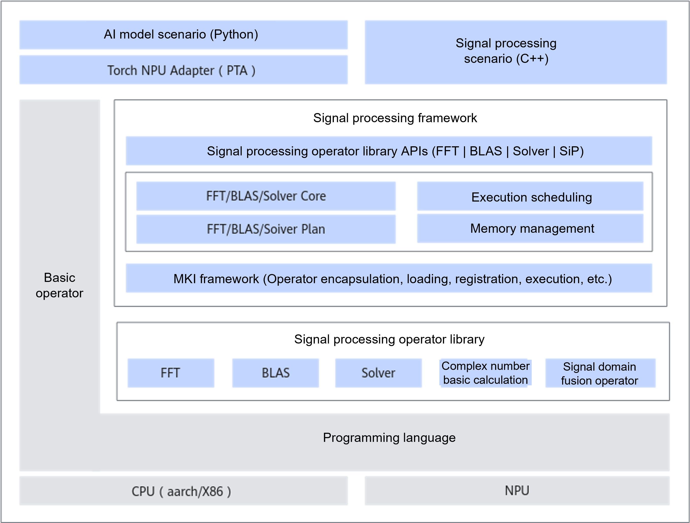

# Overview

<!-- md-trans-meta sourceCommit=cec88e057607a630073cce4bbace3c21f8d93fe7 translatedAt=2026-08-12T10:59:40.487Z pushedAt=2026-08-20T11:47:59.836Z -->

The Ascend signal processing acceleration library (AscendSiPBoost) is designed for AI model scenarios (supporting PyTorch calls) and signal processing scenarios (supporting direct C++ calls). It provides high-performance operators in the signal processing domain, including BLAS (Basic Linear Algebra Subprograms), FFT (Fast Fourier Transform), basic complex number computation, and signal-domain fusion operators.

This document is intended to guide the installation and deployment of the signal processing acceleration library, and to provide example code based on typical use cases to help developers quickly become familiar with its usage.

## Architecture Diagram

The following figure shows the position of the signal processing acceleration library in the Ascend operator technology stack.
 

- Signal processing acceleration library framework: Responsible for operator management, binary loading of operators on the device side, and tiling on the host side; responsible for providing interfaces for single-operator and multi-operator batch calls, among others.

- FFT operators: Include dedicated NPU kernels and a PLAN framework, providing external interfaces to implement C2C, C2R, and R2C for developers to use.

- BLAS operators: Provide dedicated kernels in accordance with BLAS-related standard definitions, and offer external interfaces from level 1 to level 3 for developers to use.

- Complex number basic computation library: Provides basic operators that support complex number types, allowing users to use them in combinations as needed. Not provided in this release.

- Signal domain fusion operator library: Includes fusion operators such as PC, MTD, CFAR, and Interpolation, supporting scenarios such as pulse signal analysis, moving target detection, and constant false alarm rate (CFAR). This release provides some interpolation operators.

- Solver operators: Primarily provides complex linear algebra functions based on BLAS, such as matrix decomposition and eigenvalue solving. Not provided in this release.

## Applicable Products

  <term>Atlas A2 training products / Atlas A2 inference products</term>\
  <term>Atlas A3 training products / Atlas A3 inference products</term>\
  <term>Ascend 950PR / Ascend 950DT</term> 
  