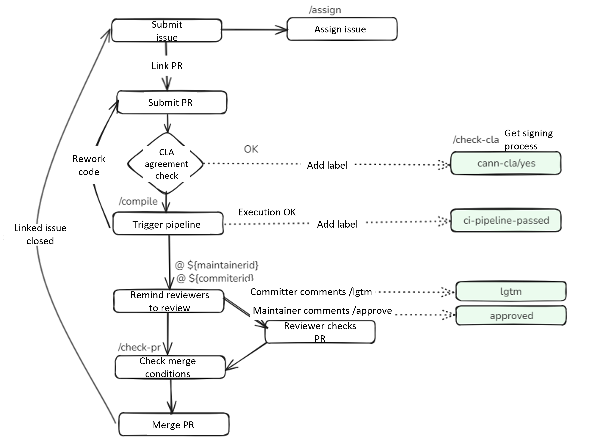

# Community User Interaction Flow and Interaction Commands

<!-- md-trans-meta sourceCommit=cec88e057607a630073cce4bbace3c21f8d93fe7 translatedAt=2026-08-12T10:58:10.520Z pushedAt=2026-08-20T11:47:59.820Z -->

## 🚀CANN Community User Interaction Flow

All projects in the CANN community are maintained by Bot. This means developers can trigger Bot commands by commenting under each Pull Request or Issue. The main interaction flow diagram is as follows:

## 🎯Command Details

<table class="command">
    <thead>
        <tr>
            <th width="15%">Command</th>
            <th width="15%">Example</th>
            <th width="10%">Scope</th>
            <th width="30%">Description</th>
            <th width="15%">Target</th>
            <th width="15%">Repository</th>
        </tr>
    </thead>
    <tbody>
        <tr>
            <td>                /check-cla
            </td>
            <td style="white-space:nowrap;">                /check-cla
            </td>
            <td>                <strong>Pull Request</strong>
            </td>
            <td>                Forcibly rechecks the CLA status of the Pull Request.
                If the committer of the Pull Request has signed the CLA, the <strong>cann-cla/yes</strong> label will be added to the Pull Request; otherwise, the <strong>cann-cla/no</strong> label will be added to the Pull Request.
            </td>
            <td>                All developers
            </td>
            <td>                All repositories
            </td>
        </tr>
        <tr>
            <td>                /cla cancel
            </td>
            <td style="white-space:nowrap;">                /cla cancel
            </td>
            <td>                <strong>Pull Request</strong>
            </td>
            <td>                Forcefully remove the <strong>cann-cla/yes</strong> label.
            </td>
            <td>               Repository administrator
            </td>
            <td>                All repositories
            </td>
        </tr>
        <tr>
           <td>                compile
           </td>
           <td style="white-space:nowrap;">                compile
           </td>
           <td>                <strong>Pull Request</strong>
            </td>
           <td>                Triggers a build in the CodeArts pipeline.
                After the build passes, the Pull Request is labeled with <strong>ci-pipeline-passed</strong>. If the build fails, the Pull Request is labeled with <strong>ci-pipeline-failed</strong>.
           </td>
           <td>              All developers
           </td>
           <td>              All repositories
           </td>
        </tr>
        <tr>
            <td>                /lgtm
            </td>
            <td style="white-space:nowrap;">                /lgtm
            </td>
            <td>                <strong>Pull Request</strong>
            </td>
            <td>                Add the <strong>lgtm</strong> label, which indicates that the code has been reviewed.
            </td>
            <td>                Reviewers of the SIG group that owns the repository
            </td>
            <td>                All repositories
            </td>
        </tr>
        <tr>
            <td>                /lgtm cancel
            </td>
            <td style="white-space:nowrap;">                /lgtm cancel
            </td>
            <td>                <strong>Pull Request</strong>
            </td>
            <td>                Removes the <strong>lgtm</strong> label, which indicates that the code has been reviewed.
            </td>
            <td>              Reviewers of the SIG group that owns the repository
            </td>
            <td>                All repositories
            </td>
        </tr>
        <tr>
            <td>                /approve
            </td>
            <td style="white-space:nowrap;">                /approve
            </td>
            <td>                <strong>Pull Request</strong>
            </td>
            <td>                Adds the <strong>approved</strong> label, which represents committers' approval of a merge.
            </td>
            <td>                Committers of the SIG group that owns the repository
            </td>
            <td>                All repositories
            </td>
        </tr>
        <tr>
            <td>                /approve cancel
            </td>
            <td style="white-space:nowrap;">                /approve cancel
            </td>
            <td>                <strong>Pull Request</strong>
            </td>
            <td>                Removes the <strong>approved</strong> label, which indicates that committers have approved the merge.
            </td>
            <td>                Committers of the SIG group that owns the repository
            </td>
            <td>                All repositories
            </td>
        </tr>
        <tr>
            <td>                /check-pr
            </td>
            <td style="white-space:nowrap;">                /check-pr
            </td>
            <td>                <strong>Pull Request</strong>
            </td>
            <td>                Checks whether the labels in the Pull Request meet the conditions. If so, merges the Pull Request.
            </td>
            <td>                Anyone can trigger this command on a Pull Request.
            </td>
            <td>                All repositories
            </td>
        </tr>
        <tr>
            <td>                /merge
            </td>
            <td style="white-space:nowrap;">                /merge
            </td>
            <td>                <strong>Pull Request</strong>
            </td>
            <td>                Adds the <strong>keeper_approved</strong> label, which is used to represent the branch_keeper's approval of the merge.
            </td>
            <td>                The branch_keeper of the corresponding branch of the repository
            </td>
            <td>                All repositories
            </td>
        </tr>
        <tr>
            <td>                /kind **
            </td>
            <td style="white-space:nowrap;">                /kind bug
                 **Accepts uppercase and lowercase letters, digits, hyphens (-), and underscores (_).
                 The same rule applies to the following commands marked with **.
            </td>
            <td>                <strong>Pull Request</strong>
                 <strong>Issue</strong>
            </td>
            <td>                Add label <strong>kind/bug</strong>.
            </td>
            <td>                Repository administrators can add labels directly. Others can add labels by commenting, such as kind/AI, provided that the label already exists in the repository; otherwise, the label cannot be added.
            </td>
            <td>                All repositories
            </td>
        </tr>
        <tr>
            <td>                /remove-kind **
            </td>
            <td style="white-space:nowrap;">                /remove-kind bug
            </td>
            <td>                <strong>Pull Request</strong>
                 <strong>Issue</strong>
            </td>
            <td>                Remove label <strong>kind/bug</strong>.
            </td>
            <td>                Owner
            </td>
            <td>                All repositories
            </td>
        </tr>
        <tr>
            <td>                /priority **
            </td>
            <td style="white-space:nowrap;">                /priority high
            </td>
            <td>                <strong>Pull Request</strong>
                 <strong>Issue</strong>
            </td>
            <td>                Add label <strong>priority/high</strong>.
            </td>
            <td>                Repository administrators can add labels directly; others can add labels via comments, such as kind/AI, provided that the label already exists in the repository, otherwise it will not be added.
            </td>
            <td>                All repositories
            </td>
        </tr>
        <tr>
            <td>                /remove-priority **
            </td>
            <td style="white-space:nowrap;">                /remove-priority high
            </td>
            <td>                <strong>Pull Request</strong>
                 <strong>Issue</strong>
            </td>
            <td>                Remove label <strong>priority/high</strong>.
            </td>
            <td>                Owner
            </td>
            <td>                All repositories
            </td>
        </tr>
        <tr>
            <td>                /sig **
            </td>
            <td style="white-space:nowrap;">                /sig AI
            </td>
            <td>                <strong>Pull Request</strong>
                 <strong>Issue</strong>
            </td>
            <td>                Add label <strong>sig/AI</strong>.
            </td>
            <td>                Repository administrators can add it directly; other users can add labels using comments, such as kind/AI, provided that the label already exists in the repository; otherwise, the label cannot be added.
            </td>
            <td>                All repositories
            </td>
        </tr>
        <tr>
            <td>                /remove-sig **
            </td>
            <td style="white-space:nowrap;">                /remove-sig AI
            </td>
            <td>                <strong>Pull Request</strong>
                 <strong>Issue</strong>
            </td>
            <td>                Removes the label <strong>sig/AI</strong>.
            </td>
            <td>                Owner
            </td>
            <td>                All repositories
            </td>
        </tr>
        <tr>
            <td>                /assign [[@]...]
            </td>
            <td style="white-space:nowrap;">                /assign 
                 /assign @cann-robot
            </td>
            <td>                 <strong>Issue</strong>
            </td>
            <td>                Assigns a person in charge to the Issue.
            </td>
            <td>                Everyone
            </td>
            <td>                All repositories
            </td>
        </tr>
        <tr>
            <td>                /unassign [[@]...]
            </td>
            <td style="white-space:nowrap;">                /unassign 
                 /unassign @cann-robot
            </td>
            <td>                 <strong>Issue</strong>
            </td>
            <td>                Unassign the person in charge of the Issue.
            </td>
            <td>                Owner
            </td>
            <td>                All repositories
            </td>
        </tr>
    </tbody>
</table>
